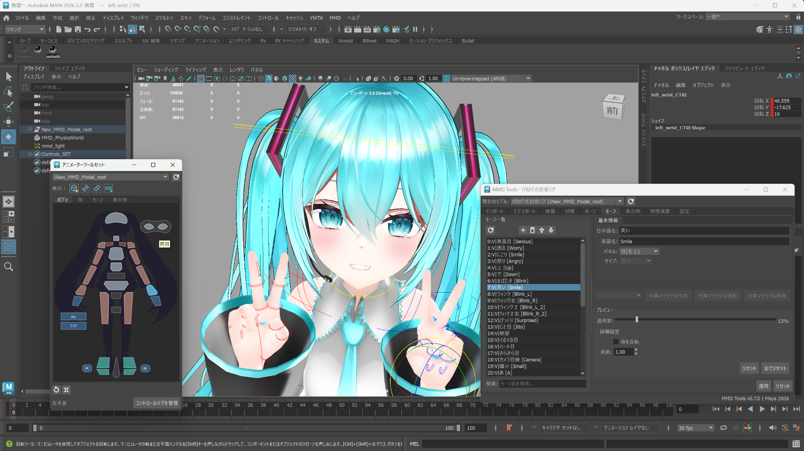
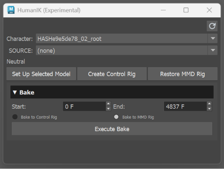

# Maya MMD Tools

[日本語ドキュメント](docs/README_ja.md)

Maya MMD Tools is a tool for importing MikuMikuDance (MMD) PMD/PMX models and VMD motions into Autodesk Maya.

Its long-term goal is to provide a complete workflow for editing and exporting models and animations.

> Credits — Model: [Sour](https://bowlroll.net/file/146103) / Motion: [mobiusP](https://www.nicovideo.jp/watch/sm42576784)

> [!WARNING]
> Maya MMD Tools is currently in alpha, and its UI and workflows may change. Comprehensive guides for individual features are not yet available. See the feature support matrix below for details.

## Feature Support Matrix

Legend: ✅ Supported · ℹ️ Partial / with caveats · 🧪 Experimental · ⛔ Not supported

### Model (PMX, PMD)

| Feature | Status | Notes |
|---|---|---|
| Mesh | ℹ️ | SDEF and QDEF are imported as linear skin weights and exported as BDEF4; their deformation algorithms are not preserved. The PMX 2.0 export path preserves additional UV channels as metadata; UV morph runtime evaluation in Maya is not verified. |
| Materials & textures | ℹ️ | MMD toon shaders are implemented for DX11 and OpenGL. Supported PMX material fields, including shared toon indices and non-shared custom toon path/index authoring, have focused import/edit/export/fresh-import checks. PMD material import/display/edit is supported. Reproduction fidelity is limited by Viewport 2.0 constraints. |
| Maya name resolution | ✅ | Names are converted to safe Maya names using a dictionary or a hash. Texture paths are also resolved automatically to safe paths. |
| Edge / outline flags | ℹ️ | Can be enabled as an option, subject to Viewport 2.0 constraints. |
| Bones, skeleton & rig (IK / append / local axis) | ℹ️ | Partially supported. PMX 2.0 export preserves and fresh-import verifies the canonical IK target/loop/angle/link subset plus flag-dependent append, tail, fixed/local-axis, after-physics, and external-parent metadata. Malformed or unresolved references fail closed; complex runtime rigs can still have known issues. |
| Display frames (表示枠) | ℹ️ | Display-frame names, special-frame flags, and ordered bone/morph items can be edited. |
| Morphs (vertex / bone / material / group / UV) | ℹ️ | Vertex, bone, material, and group morphs are supported. PMX 2.0 UV/additional-UV morph metadata (types 3–7) is preserved through export and fresh import, but does not currently deform Maya UV sets. |
| Physics (rigid bodies & joints) | ℹ️ | Some physics editing operations remain unsupported. PMX/PMD physics data is imported by default; object creation, duplication, and deletion are not yet supported. |
| Soft body (PMX 2.1) | ⛔ | Not supported |
| Export | ℹ️ | PMX 2.0 export is available from the Export workflow for the validated fields above. Vertex skinning is written uniformly as BDEF4. Validation is fail-closed and preserves an existing output on rejection. Explicit SDEF/QDEF payloads and PMX 2.1-only features such as Flip morphs, Impulse morphs, and soft bodies are intentionally unsupported. Full PMX field or visual parity is not claimed. PMD is import-only. |

### Animation (VMD)

| Feature | Status | Notes |
|---|---|---|
| Bone animation | ℹ️ | Basic MMD rigs are supported, but complex mechanisms are not. Bake mode uses [mmd-anim](https://github.com/yohawing/mmd-anim) for high-accuracy baking. |
| VPD | ✅ | Drag-and-drop import only |
| Morph animation | ℹ️ | Vertex, bone, and material morphs are supported. UV morph metadata is preserved for development round-trip, but Maya UV-set runtime evaluation remains unverified. Flip and Impulse morphs are not supported. |
| Camera animation | ✅ | Creates and keys `mmd_camera`. Lighting drives the `mmd_light` controller. VMD camera/light export is currently unsupported; a future C++ export route is planned. Self-shadow remains unsupported. |
| IK on/off frames | ℹ️ | Supported for import and bake. Runtime bake applies the state to the final pose; rig mode keys `mmdCcdIk.enabled`. |
| Physics | ℹ️ | Supports Bullet-based real-time physics and physics bake. Live evaluation is off by default and can be enabled from the Physics tab. Accuracy is still limited. |
| HumanIK / retargeting | 🧪 | Experimental support for retargeting between imported MMD models. Try it from `MMD > HumanIK (Experimental)`. |
| Control Rig | 🧪 | A Control Rig is generated automatically based on the semi-standard bone layout. |
| Export | ℹ️ | VMD export is available from the Export workflow. It always evaluates and bakes the current character scene over the selected timeline; imported source-VMD identity and raw key equivalence are not an export contract. Camera/light export is currently unsupported. |

## Known Limitations

- **Detailed documentation is not written yet.** This is an alpha release, and development speed is prioritized over documentation maintenance.
- **Various features are still incomplete.** This is an experimental alpha release; feedback is welcome.
- **QDEF and SDEF are downgraded to BDEF4.** Their specialized deformation is not preserved, so meshes may appear thinner with some model and motion combinations.
- **Export supports a bounded, validated scope.** PMX vertex skinning is written uniformly as BDEF4; SDEF/QDEF algorithms and auxiliary data are not retained. PMX 2.0 additional UV channels, UV/additional-UV morph metadata, and the documented canonical bone/IK subset are preserved through fresh import, but UV morphs are not evaluated on Maya UV sets. Explicit SDEF/QDEF payloads and PMX 2.1-only Flip morph, Impulse morph, and soft-body export are rejected fail-closed; PMD is import-only. VMD export evaluates the current character scene with a fixed Bake Timeline strategy; camera/light and self-shadow export are unsupported. These gates do not claim complete PMX field coverage or visual parity.
- **HumanIK is published as an experimental feature.** Only the minimum workflow is exposed. Try it from `MMD > HumanIK (Experimental)`.
- **Leg rotations and bones that conflict with bone morphs work only under the Control Rig.** Bones may become immovable when their connections conflict with bone morphs.

## System Requirements

### Required

- **Maya**: 2024 or later
- **OS**: Windows 11 / macOS 15.6
- **Python**: 3.10 or later (bundled with Maya 2024+)

## Installation

### Download

1. Download the latest release from the [GitHub Releases page](https://github.com/yohawing/maya_mmd_tools/releases).
2. Extract the ZIP file to a temporary folder.

### Drag and Drop Install

1. Start Maya.
2. Drag `drag_drop_install.py` from the extracted folder into the Maya viewport.
3. Confirm the install dialog.
4. Restart Maya.

The installer copies all Maya MMD Tools files into Maya's user `modules` folder, then writes a `maya_mmd_tools.mod` file next to that copy.

### Enable the Plugin

1. Start Maya. If Maya is already running, restart it.
2. Open `Window > Settings/Preferences > Plug-in Manager`.
3. Find `mmd_tools_plugin.py`.
4. Check `Loaded`.
5. If you want it to load automatically, also check `Auto load`.
6. For more MMD-like shading, also enable `dx11Shader`; `Create MMD Shader` is enabled by default.

## Verify Installation

### Check the Menu

Confirm that `MMD > MMD Editor` appears in Maya's menu bar.

## Quick Start

### Open MMD Editor

1. Select `MMD > MMD Editor`.
2. The MMD Editor window opens.
3. You can inspect and adjust settings in each tab.

The UI fields follow PMX Editor conventions. Many fields are not yet implemented, so the tool should currently be considered primarily a preview tool.

### Import a Model

1. In the Import tab, choose a PMX or PMD file to import.
2. Click `Import Model`.

If textures fail to load due to multi-byte characters in the path, enable the automatic texture repair option. The textures will be copied automatically and renamed to loadable names.

### Import Animation

1. In the Import/Export tab, choose a VMD file.
2. Click `Import Animation`.
3. The animation is applied to the matching model in the scene.

### Use HumanIK (Experimental)

1. Select `MMD > HumanIK (Experimental)` from Maya's menu bar to open the standalone window.
2. Select the MMD character's ModelRoot and click `Set Up Selected Model` to create its character definition.
3. Import two characters and set up both. Choose the character that contains the motion from the SOURCE list to retarget its motion.
4. The retargeted motion can be baked to a Control Rig.
5. Use `Restore MMD Rig` to return from the Control Rig to the MMD rig state.

Using Maya's HumanIK features directly can break the MMD rig in some workflows.

## Viewport Setup

To view the shader that reproduces the MMD toon look, enable the MMD shader creation option and the shader plug-in for your rendering environment. Use the `dx11Shader` plug-in on Windows and the `glslShader` (GLSLShader) plug-in on macOS. The following settings are also applied automatically on import:

- **Rendering space** → `ACEScg` → `scene-linear Rec.709-sRGB`.
- **View Transform** → `ACES 1.0 SDR-video (sRGB)` → `Un-tone-mapped (sRGB)`.

Both are applied to reproduce the MMD-style color response (sRGB gamma-space input/output).

## Support

If the problem is not resolved, report it on [GitHub Issues](https://github.com/yohawing/maya_mmd_tools/issues) with the following information:
